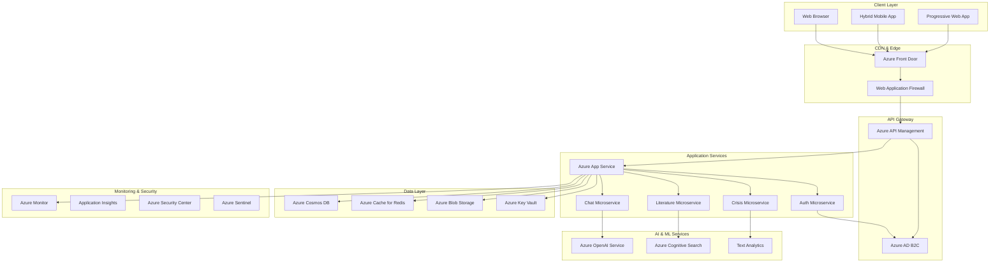

# Digital Sponsor - Technical Architecture Specification

## Executive Summary

This document outlines the complete Azure-based technical architecture for Digital Sponsor,
implementing industry best practices including 12-Factor App principles, SOLID design patterns, DRY
methodology, and Microsoft's Well-Architected Framework. The architecture prioritizes security,
scalability, maintainability, and AA Traditions compliance.

---

## 1. Architecture Overview

### 1.1 High-Level Architecture Diagram



### 1.2 Technology Stack Selection

#### Frontend Stack

```yaml
framework: 'React 18 with TypeScript'
state_management: 'Redux Toolkit + RTK Query'
ui_library: 'Chakra UI (WCAG 2.1 AA compliant)'
pwa_framework: 'Vite with PWA plugin'
mobile_wrapper: 'Capacitor for hybrid mobile apps'
testing: 'Vitest + React Testing Library'
linting: 'ESLint + Prettier + Husky'
```

#### Backend Stack

```yaml
runtime: 'Node.js 18 LTS'
framework: 'Express.js with TypeScript'
api_documentation: 'OpenAPI 3.0 + Swagger'
validation: 'Joi + express-validator'
security: 'Helmet.js + express-rate-limit'
logging: 'Winston + Azure Monitor'
testing: 'Jest + Supertest'
linting: 'ESLint + Prettier'
```

#### Infrastructure Stack

```yaml
cloud_provider: 'Microsoft Azure'
container_orchestration: 'Azure Container Instances / Azure Kubernetes Service'
ci_cd: 'Azure DevOps + GitHub Actions'
infrastructure_as_code: 'Azure Resource Manager (ARM) Templates + Bicep'
monitoring: 'Azure Monitor + Application Insights'
security: 'Azure Security Center + Azure Sentinel'
```

---

## 2. Security Architecture & API Key Management

### 2.1 Azure Key Vault Implementation

```json
{
  "keyVaultConfiguration": {
    "name": "digital-sponsor-keyvault",
    "location": "East US",
    "sku": "Standard",
    "accessPolicies": [
      {
        "tenantId": "{{azure-tenant-id}}",
        "objectId": "{{app-service-managed-identity}}",
        "permissions": {
          "secrets": ["get", "list"]
        }
      }
    ],
    "secrets": {
      "OpenAI-API-Key": {
        "value": "OPEN_AI_KEY",
        "contentType": "OpenAI API Key for Digital Sponsor",
        "attributes": {
          "enabled": true,
          "expires": "2025-12-31T23:59:59Z"
        }
      },
      "Database-Connection-String": {
        "value": "{{cosmos-db-connection-string}}",
        "contentType": "Cosmos DB connection string"
      },
      "Redis-Connection-String": {
        "value": "{{redis-connection-string}}",
        "contentType": "Redis cache connection string"
      }
    }
  }
}
```

### 2.2 Managed Identity Configuration

```yaml
managed_identity_setup:
  type: 'System-assigned'
  scope: 'App Service + Key Vault'

key_vault_access:
  authentication_method: 'Managed Identity'
  permissions: 'Get Secrets only'
  network_access: 'Private endpoint + selected networks'

environment_variables:
  AZURE_CLIENT_ID: '{{system-assigned-identity-client-id}}'
  KEY_VAULT_URL: 'https://digital-sponsor-keyvault.vault.azure.net/'
  OPENAI_KEY_SECRET_NAME: 'OpenAI-API-Key'
```

### 2.3 Security Implementation

```typescript
// Key Vault Secret Manager
import { DefaultAzureCredential } from '@azure/identity';
import { SecretClient } from '@azure/keyvault-secrets';

class SecureConfigManager {
  private secretClient: SecretClient;
  private cache: Map<string, { value: string; expiry: number }>;

  constructor() {
    const credential = new DefaultAzureCredential();
    const keyVaultUrl = process.env.KEY_VAULT_URL!;
    this.secretClient = new SecretClient(keyVaultUrl, credential);
    this.cache = new Map();
  }

  async getSecret(secretName: string, cacheTTL: number = 300000): Promise<string> {
    // Check cache first (5-minute default TTL)
    const cached = this.cache.get(secretName);
    if (cached && Date.now() < cached.expiry) {
      return cached.value;
    }

    try {
      const secret = await this.secretClient.getSecret(secretName);
      const value = secret.value!;

      // Cache the secret
      this.cache.set(secretName, {
        value,
        expiry: Date.now() + cacheTTL,
      });

      return value;
    } catch (error) {
      throw new Error(`Failed to retrieve secret ${secretName}: ${error}`);
    }
  }

  async getOpenAIKey(): Promise<string> {
    return this.getSecret('OpenAI-API-Key');
  }
}

export const configManager = new SecureConfigManager();
```

---

## 3. 12-Factor App Implementation

### 3.1 Codebase

- **Single codebase**: Git repository with multiple deployment environments
- **Version control**: Git with semantic versioning
- **Branching strategy**: GitFlow with main/develop/feature branches

### 3.2 Dependencies

```json
{
  "package.json": {
    "dependencies": {
      "explicitly_declared": "All dependencies in package.json",
      "no_system_dependencies": "No reliance on system packages",
      "locked_versions": "package-lock.json for reproducible builds"
    }
  }
}
```

### 3.3 Config

```typescript
// Environment-based configuration
interface AppConfig {
  environment: 'development' | 'staging' | 'production';
  port: number;
  keyVaultUrl: string;
  cosmosDbEndpoint: string;
  redisEndpoint: string;
  corsOrigins: string[];
  logLevel: string;
}

const config: AppConfig = {
  environment: (process.env.NODE_ENV as any) || 'development',
  port: parseInt(process.env.PORT || '3000'),
  keyVaultUrl: process.env.KEY_VAULT_URL!,
  cosmosDbEndpoint: process.env.COSMOS_DB_ENDPOINT!,
  redisEndpoint: process.env.REDIS_ENDPOINT!,
  corsOrigins: process.env.CORS_ORIGINS?.split(',') || ['http://localhost:3000'],
  logLevel: process.env.LOG_LEVEL || 'info',
};
```

### 3.4 Backing Services

- **Cosmos DB**: Treated as attached resource via connection string
- **Redis**: Attached cache service
- **Azure OpenAI**: External AI service
- **Azure Key Vault**: Secrets management service

### 3.5 Build, Release, Run

```yaml
build_stage:
  - npm install
  - npm run build
  - docker build

release_stage:
  - combine build artifacts with config
  - create immutable release package
  - deploy to Azure Container Registry

run_stage:
  - pull release from registry
  - inject environment-specific config
  - execute in Azure App Service
```

### 3.6 Processes

- **Stateless**: No local file storage or session state
- **Process isolation**: Each microservice runs independently
- **Horizontal scalability**: Can scale by adding more processes

### 3.7 Port Binding

```typescript
// Self-contained service with port binding
const app = express();
const port = process.env.PORT || 3000;

app.listen(port, () => {
  console.log(`Digital Sponsor API listening on port ${port}`);
});
```

### 3.8 Concurrency

```yaml
scaling_model:
  process_types:
    web: 'HTTP request handlers'
    worker: 'Background job processors'

  scaling_strategy:
    horizontal: 'Scale by adding more instances'
    azure_autoscaling: 'Based on CPU/memory metrics'
```

### 3.9 Disposability

- **Fast startup**: < 10 seconds container startup time
- **Graceful shutdown**: Proper SIGTERM handling
- **Crash resilience**: Health checks and auto-restart

### 3.10 Dev/Prod Parity

```yaml
environment_consistency:
  development:
    database: 'Cosmos DB Emulator'
    cache: 'Local Redis container'
    ai_service: 'Azure OpenAI with dev quota'

  production:
    database: 'Azure Cosmos DB'
    cache: 'Azure Cache for Redis'
    ai_service: 'Azure OpenAI with production quota'

  deployment_tool: 'Docker containers ensure consistency'
```

### 3.11 Logs

```typescript
// Structured logging to stdout
import winston from 'winston';

const logger = winston.createLogger({
  format: winston.format.combine(
    winston.format.timestamp(),
    winston.format.errors({ stack: true }),
    winston.format.json()
  ),
  defaultMeta: { service: 'digital-sponsor-api' },
  transports: [new winston.transports.Console()],
});

// Azure Monitor integration
if (process.env.APPLICATIONINSIGHTS_CONNECTION_STRING) {
  logger.add(new winston.transports.ApplicationInsights());
}
```

### 3.12 Admin Processes

```bash
# One-off administrative tasks
npm run db:migrate
npm run literature:index
npm run user:cleanup
npm run health:check
```

---

## 4. SOLID Principles Implementation

### 4.1 Single Responsibility Principle

```typescript
// Each class has a single, well-defined responsibility

class OpenAIService {
  // Responsible only for OpenAI API interactions
  async generateResponse(prompt: string, context: string[]): Promise<AIResponse> {
    // Implementation
  }
}

class LiteratureSearchService {
  // Responsible only for literature search and retrieval
  async searchLiterature(query: string): Promise<LiteratureResult[]> {
    // Implementation
  }
}

class CrisisDetectionService {
  // Responsible only for crisis detection logic
  async detectCrisis(message: string): Promise<CrisisLevel> {
    // Implementation
  }
}
```

### 4.2 Open/Closed Principle

```typescript
// Open for extension, closed for modification

interface ResponseGenerator {
  generateResponse(prompt: string, context: any): Promise<string>;
}

class OpenAIResponseGenerator implements ResponseGenerator {
  async generateResponse(prompt: string, context: any): Promise<string> {
    // OpenAI implementation
  }
}

class ClaudeResponseGenerator implements ResponseGenerator {
  async generateResponse(prompt: string, context: any): Promise<string> {
    // Claude implementation (future extension)
  }
}

class ChatService {
  constructor(private responseGenerator: ResponseGenerator) {}

  async processChat(message: string): Promise<string> {
    return this.responseGenerator.generateResponse(message, {});
  }
}
```

### 4.3 Liskov Substitution Principle

```typescript
// Subtypes must be substitutable for their base types

abstract class DatabaseProvider {
  abstract save(data: any): Promise<void>;
  abstract find(id: string): Promise<any>;
}

class CosmosDBProvider extends DatabaseProvider {
  async save(data: any): Promise<void> {
    // Cosmos DB implementation
  }

  async find(id: string): Promise<any> {
    // Cosmos DB implementation
  }
}

class InMemoryDBProvider extends DatabaseProvider {
  async save(data: any): Promise<void> {
    // In-memory implementation (for testing)
  }

  async find(id: string): Promise<any> {
    // In-memory implementation
  }
}
```

### 4.4 Interface Segregation Principle

```typescript
// Clients should not depend on interfaces they don't use

interface Readable {
  read(id: string): Promise<any>;
}

interface Writable {
  write(data: any): Promise<void>;
}

interface Cacheable {
  cache(key: string, value: any): Promise<void>;
  getCached(key: string): Promise<any>;
}

// Services implement only what they need
class LiteratureService implements Readable, Cacheable {
  async read(id: string): Promise<any> {
    /* implementation */
  }
  async cache(key: string, value: any): Promise<void> {
    /* implementation */
  }
  async getCached(key: string): Promise<any> {
    /* implementation */
  }
}

class UserService implements Writable {
  async write(data: any): Promise<void> {
    /* implementation */
  }
}
```

### 4.5 Dependency Inversion Principle

```typescript
// Depend on abstractions, not concretions

interface ILogger {
  info(message: string): void;
  error(message: string, error?: Error): void;
}

interface IConfigManager {
  getSecret(name: string): Promise<string>;
}

class ChatController {
  constructor(
    private logger: ILogger,
    private configManager: IConfigManager,
    private openAIService: OpenAIService
  ) {}

  async handleChat(req: Request, res: Response): Promise<void> {
    try {
      this.logger.info('Processing chat request');
      const apiKey = await this.configManager.getSecret('OpenAI-API-Key');
      // Process request
    } catch (error) {
      this.logger.error('Chat processing failed', error);
    }
  }
}
```

---

## 5. DRY (Don't Repeat Yourself) Implementation

### 5.1 Shared Utilities

```typescript
// Common utilities to avoid code duplication

export class ValidationUtils {
  static validateEmail(email: string): boolean {
    const emailRegex = /^[^\s@]+@[^\s@]+\.[^\s@]+$/;
    return emailRegex.test(email);
  }

  static sanitizeInput(input: string): string {
    return input.trim().replace(/[<>]/g, '');
  }
}

export class ResponseUtils {
  static createSuccessResponse<T>(data: T, message?: string) {
    return {
      success: true,
      data,
      message: message || 'Operation completed successfully',
    };
  }

  static createErrorResponse(message: string, code?: number) {
    return {
      success: false,
      error: message,
      code: code || 500,
    };
  }
}
```

### 5.2 Configuration Constants

```typescript
// Centralized configuration constants

export const CONFIG = {
  API: {
    VERSION: 'v1',
    RATE_LIMIT: {
      WINDOW_MS: 15 * 60 * 1000, // 15 minutes
      MAX_REQUESTS: 100,
    },
    TIMEOUT_MS: 30000,
  },
  CHAT: {
    MAX_CONTEXT_LENGTH: 10,
    RESPONSE_TIMEOUT_MS: 30000,
    MAX_MESSAGE_LENGTH: 2000,
  },
  CRISIS: {
    KEYWORDS: [
      'suicide',
      'suicidal',
      'kill myself',
      'end it all',
      'overdose',
      'pills',
      'harm myself',
      'cut myself',
    ],
    RESPONSE_TIMEOUT_MS: 1000,
  },
  SECURITY: {
    SESSION_TIMEOUT_MS: 30 * 60 * 1000, // 30 minutes
    JWT_EXPIRES_IN: '15m',
    REFRESH_TOKEN_EXPIRES_IN: '7d',
  },
} as const;
```

### 5.3 Reusable Middleware

```typescript
// DRY middleware patterns

export const authMiddleware = (req: Request, res: Response, next: NextFunction) => {
  const token = req.headers.authorization?.split(' ')[1];
  if (!token) {
    return res.status(401).json(ResponseUtils.createErrorResponse('No token provided'));
  }
  // Validate token
  next();
};

export const rateLimitMiddleware = rateLimit({
  windowMs: CONFIG.API.RATE_LIMIT.WINDOW_MS,
  max: CONFIG.API.RATE_LIMIT.MAX_REQUESTS,
  message: ResponseUtils.createErrorResponse('Too many requests'),
});

export const validationMiddleware = (schema: Joi.Schema) => {
  return (req: Request, res: Response, next: NextFunction) => {
    const { error } = schema.validate(req.body);
    if (error) {
      return res.status(400).json(ResponseUtils.createErrorResponse(error.details[0].message));
    }
    next();
  };
};
```

---

## 6. Azure Well-Architected Framework Implementation

### 6.1 Cost Optimization

#### Cost Management Strategy

```yaml
cost_optimization:
  compute:
    app_service: 'P1v3 with auto-scaling (2-5 instances)'
    estimated_monthly: '$146-365'

  storage:
    cosmos_db: 'Provisioned throughput 1000 RU/s'
    blob_storage: 'Hot tier for active literature'
    estimated_monthly: '$73'

  ai_services:
    azure_openai: 'Standard pricing with usage monitoring'
    cognitive_search: 'S1 tier for 15GB search index'
    estimated_monthly: '$250'

  monitoring:
    application_insights: '5GB data retention'
    log_analytics: 'Basic tier'
    estimated_monthly: '$23'

  total_estimated: '$492-711/month'
```

#### Cost Control Implementation

```typescript
// Usage monitoring and alerting
class CostMonitoringService {
  async trackOpenAIUsage(tokens: number, cost: number): Promise<void> {
    await this.logUsage('openai', { tokens, cost });

    if (cost > this.getDailyBudget()) {
      await this.sendCostAlert('Daily OpenAI budget exceeded');
    }
  }

  private getDailyBudget(): number {
    return parseFloat(process.env.DAILY_AI_BUDGET || '10');
  }
}
```

### 6.2 Operational Excellence

#### Infrastructure as Code

```yaml
# Azure Resource Manager Template (ARM)
{
  '$schema': 'https://schema.management.azure.com/schemas/2019-04-01/deploymentTemplate.json#',
  'contentVersion': '1.0.0.0',
  'parameters':
    { 'environmentName': { 'type': 'string', 'allowedValues': ['dev', 'staging', 'prod'] } },
  'resources':
    [
      {
        'type': 'Microsoft.Web/serverfarms',
        'apiVersion': '2021-02-01',
        'name': "[concat('digital-sponsor-plan-', parameters('environmentName'))]",
        'location': '[resourceGroup().location]',
        'sku': { 'name': 'P1v3', 'tier': 'PremiumV3' },
      },
    ],
}
```

#### CI/CD Pipeline

```yaml
# Azure DevOps Pipeline
trigger:
  branches:
    include:
      - main
      - develop
      - release/*

stages:
  - stage: Build
    jobs:
      - job: BuildJob
        pool:
          vmImage: 'ubuntu-latest'
        steps:
          - task: NodeTool@0
            inputs:
              versionSpec: '18.x'
          - script: |
              npm ci
              npm run build
              npm run test
              npm run lint
          - task: PublishTestResults@2
          - task: PublishCodeCoverageResults@1

  - stage: Deploy
    condition: and(succeeded(), eq(variables['build.sourceBranch'], 'refs/heads/main'))
    jobs:
      - deployment: Production
        environment: 'production'
        strategy:
          runOnce:
            deploy:
              steps:
                - task: AzureWebApp@1
```

### 6.3 Performance Efficiency

#### Caching Strategy

```typescript
// Multi-level caching implementation
class CacheManager {
  private redisClient: RedisClient;
  private localCache: Map<string, any>;

  async get(key: string): Promise<any> {
    // L1: Local memory cache
    if (this.localCache.has(key)) {
      return this.localCache.get(key);
    }

    // L2: Redis distributed cache
    const redisValue = await this.redisClient.get(key);
    if (redisValue) {
      this.localCache.set(key, JSON.parse(redisValue));
      return JSON.parse(redisValue);
    }

    return null;
  }

  async set(key: string, value: any, ttl: number): Promise<void> {
    this.localCache.set(key, value);
    await this.redisClient.setex(key, ttl, JSON.stringify(value));
  }
}
```

#### Performance Monitoring

```typescript
// Application Insights integration
import { TelemetryClient } from 'applicationinsights';

class PerformanceTracker {
  private telemetryClient: TelemetryClient;

  trackChatResponse(duration: number, accuracy: number): void {
    this.telemetryClient.trackMetric({
      name: 'ChatResponseTime',
      value: duration,
    });

    this.telemetryClient.trackMetric({
      name: 'ChatAccuracy',
      value: accuracy,
    });
  }

  trackCrisisDetection(detected: boolean, responseTime: number): void {
    this.telemetryClient.trackEvent({
      name: 'CrisisDetection',
      properties: {
        detected: detected.toString(),
        responseTime: responseTime.toString(),
      },
    });
  }
}
```

### 6.4 Reliability

#### Health Checks

```typescript
// Comprehensive health monitoring
class HealthCheckService {
  async checkHealth(): Promise<HealthStatus> {
    const checks = await Promise.all([
      this.checkDatabase(),
      this.checkRedis(),
      this.checkOpenAI(),
      this.checkKeyVault(),
    ]);

    return {
      status: checks.every(c => c.healthy) ? 'healthy' : 'unhealthy',
      timestamp: new Date().toISOString(),
      checks: {
        database: checks[0],
        cache: checks[1],
        ai_service: checks[2],
        secrets: checks[3],
      },
    };
  }

  private async checkOpenAI(): Promise<ServiceHealth> {
    try {
      const apiKey = await configManager.getOpenAIKey();
      // Verify API connectivity
      const response = await fetch('https://api.openai.com/v1/models', {
        headers: { Authorization: `Bearer ${apiKey}` },
      });

      return {
        healthy: response.ok,
        responseTime: performance.now(),
        message: response.ok ? 'OpenAI API accessible' : 'OpenAI API error',
      };
    } catch (error) {
      return {
        healthy: false,
        responseTime: -1,
        message: `OpenAI health check failed: ${error}`,
      };
    }
  }
}
```

#### Circuit Breaker Pattern

```typescript
// Prevent cascading failures
class CircuitBreaker {
  private failures = 0;
  private lastFailTime = 0;
  private state: 'CLOSED' | 'OPEN' | 'HALF_OPEN' = 'CLOSED';

  constructor(
    private threshold: number = 5,
    private timeoutMs: number = 60000
  ) {}

  async execute<T>(operation: () => Promise<T>): Promise<T> {
    if (this.state === 'OPEN') {
      if (Date.now() - this.lastFailTime < this.timeoutMs) {
        throw new Error('Circuit breaker is OPEN');
      }
      this.state = 'HALF_OPEN';
    }

    try {
      const result = await operation();
      this.onSuccess();
      return result;
    } catch (error) {
      this.onFailure();
      throw error;
    }
  }

  private onSuccess(): void {
    this.failures = 0;
    this.state = 'CLOSED';
  }

  private onFailure(): void {
    this.failures++;
    this.lastFailTime = Date.now();

    if (this.failures >= this.threshold) {
      this.state = 'OPEN';
    }
  }
}
```

### 6.5 Security

#### Security Implementation

```typescript
// Comprehensive security measures
class SecurityService {
  // Input validation and sanitization
  static sanitizeInput(input: string): string {
    return input.trim().replace(/[<>]/g, '').slice(0, 2000); // Max length
  }

  // Rate limiting with Redis
  async checkRateLimit(userId: string, endpoint: string): Promise<boolean> {
    const key = `rate_limit:${userId}:${endpoint}`;
    const current = await this.redisClient.get(key);

    if (current && parseInt(current) >= CONFIG.API.RATE_LIMIT.MAX_REQUESTS) {
      return false;
    }

    await this.redisClient.incr(key);
    await this.redisClient.expire(key, CONFIG.API.RATE_LIMIT.WINDOW_MS / 1000);

    return true;
  }

  // Audit logging
  async logSecurityEvent(event: SecurityEvent): Promise<void> {
    const auditLog = {
      timestamp: new Date().toISOString(),
      userId: event.userId,
      action: event.action,
      resource: event.resource,
      success: event.success,
      ipAddress: event.ipAddress,
      userAgent: event.userAgent,
    };

    // Log to Azure Monitor
    this.telemetryClient.trackEvent({
      name: 'SecurityEvent',
      properties: auditLog,
    });

    // Store in secure audit log
    await this.auditRepository.save(auditLog);
  }
}
```

---

## 7. Infrastructure as Code (IaC)

### 7.1 Azure Bicep Templates

```bicep
// main.bicep - Infrastructure deployment
@description('Environment name (dev, staging, prod)')
param environmentName string = 'dev'

@description('Location for all resources')
param location string = resourceGroup().location

@description('OpenAI API Key for secure storage')
@secure()
param openAiApiKey string

// Key Vault for secrets management
resource keyVault 'Microsoft.KeyVault/vaults@2021-11-01-preview' = {
  name: 'kv-digital-sponsor-${environmentName}'
  location: location
  properties: {
    sku: {
      family: 'A'
      name: 'standard'
    }
    tenantId: tenant().tenantId
    accessPolicies: [
      {
        tenantId: tenant().tenantId
        objectId: appService.identity.principalId
        permissions: {
          secrets: ['get', 'list']
        }
      }
    ]
    networkAcls: {
      bypass: 'AzureServices'
      defaultAction: 'Deny'
      virtualNetworkRules: [
        {
          id: subnet.id
          ignoreMissingVnetServiceEndpoint: false
        }
      ]
    }
  }
}

// Store OpenAI API Key securely
resource openAiSecret 'Microsoft.KeyVault/vaults/secrets@2021-11-01-preview' = {
  parent: keyVault
  name: 'OpenAI-API-Key'
  properties: {
    value: openAiApiKey
    attributes: {
      enabled: true
    }
  }
}

// App Service Plan
resource appServicePlan 'Microsoft.Web/serverfarms@2021-02-01' = {
  name: 'asp-digital-sponsor-${environmentName}'
  location: location
  sku: {
    name: 'P1v3'
    tier: 'PremiumV3'
    size: 'P1v3'
    capacity: 1
  }
  properties: {
    reserved: true // Linux
  }
}

// App Service with Managed Identity
resource appService 'Microsoft.Web/sites@2021-02-01' = {
  name: 'app-digital-sponsor-${environmentName}'
  location: location
  identity: {
    type: 'SystemAssigned'
  }
  properties: {
    serverFarmId: appServicePlan.id
    siteConfig: {
      linuxFxVersion: 'NODE|18-lts'
      appSettings: [
        {
          name: 'NODE_ENV'
          value: environmentName
        }
        {
          name: 'KEY_VAULT_URL'
          value: keyVault.properties.vaultUri
        }
        {
          name: 'APPLICATIONINSIGHTS_CONNECTION_STRING'
          value: appInsights.properties.ConnectionString
        }
      ]
    }
    httpsOnly: true
    clientAffinityEnabled: false
  }
}

// Cosmos DB for user data
resource cosmosAccount 'Microsoft.DocumentDB/databaseAccounts@2021-10-15' = {
  name: 'cosmos-digital-sponsor-${environmentName}'
  location: location
  properties: {
    databaseAccountOfferType: 'Standard'
    consistencyPolicy: {
      defaultConsistencyLevel: 'Session'
    }
    locations: [
      {
        locationName: location
        failoverPriority: 0
        isZoneRedundant: false
      }
    ]
  }
}

// Redis Cache for session management
resource redisCache 'Microsoft.Cache/redis@2021-06-01' = {
  name: 'redis-digital-sponsor-${environmentName}'
  location: location
  properties: {
    sku: {
      name: 'Standard'
      family: 'C'
      capacity: 1
    }
    enableNonSslPort: false
    minimumTlsVersion: '1.2'
  }
}

// Application Insights for monitoring
resource appInsights 'Microsoft.Insights/components@2020-02-02' = {
  name: 'ai-digital-sponsor-${environmentName}'
  location: location
  kind: 'web'
  properties: {
    Application_Type: 'web'
    Request_Source: 'rest'
  }
}

// Azure Cognitive Search for literature
resource searchService 'Microsoft.Search/searchServices@2021-04-01-preview' = {
  name: 'search-digital-sponsor-${environmentName}'
  location: location
  sku: {
    name: 'standard'
  }
  properties: {
    replicaCount: 1
    partitionCount: 1
  }
}

output keyVaultUrl string = keyVault.properties.vaultUri
output appServiceUrl string = 'https://${appService.properties.defaultHostName}'
output cosmosEndpoint string = cosmosAccount.properties.documentEndpoint
output redisHostname string = redisCache.properties.hostName
output searchServiceName string = searchService.name
```

### 7.2 Deployment Pipeline

```yaml
# azure-pipelines.yml
name: Digital Sponsor CI/CD

trigger:
  branches:
    include:
      - main
      - develop
      - release/*

variables:
  azureServiceConnection: 'Azure-Digital-Sponsor'
  resourceGroupName: 'rg-digital-sponsor'

stages:
  - stage: Build
    displayName: 'Build and Test'
    jobs:
      - job: BuildJob
        displayName: 'Build Application'
        pool:
          vmImage: 'ubuntu-latest'

        steps:
          - task: NodeTool@0
            displayName: 'Install Node.js'
            inputs:
              versionSpec: '18.x'

          - script: |
              npm ci
              npm run build
              npm run test:coverage
              npm run lint
            displayName: 'Build and Test'

          - task: PublishTestResults@2
            displayName: 'Publish Test Results'
            inputs:
              testResultsFormat: 'JUnit'
              testResultsFiles: 'coverage/junit.xml'

          - task: PublishCodeCoverageResults@1
            displayName: 'Publish Code Coverage'
            inputs:
              codeCoverageTool: 'Cobertura'
              summaryFileLocation: 'coverage/cobertura-coverage.xml'

          - task: Docker@2
            displayName: 'Build Docker Image'
            inputs:
              command: 'buildAndPush'
              repository: 'digitalsponsor/api'
              dockerfile: '**/Dockerfile'
              containerRegistry: 'digitalSponsorACR'
              tags: '$(Build.BuildId)'

  - stage: DeployInfrastructure
    displayName: 'Deploy Infrastructure'
    dependsOn: Build
    condition: and(succeeded(), eq(variables['build.sourceBranch'], 'refs/heads/main'))

    jobs:
      - deployment: Infrastructure
        displayName: 'Deploy Azure Resources'
        environment: 'production'
        pool:
          vmImage: 'ubuntu-latest'

        strategy:
          runOnce:
            deploy:
              steps:
                - task: AzureCLI@2
                  displayName: 'Deploy Bicep Template'
                  inputs:
                    azureSubscription: $(azureServiceConnection)
                    scriptType: 'bash'
                    scriptLocation: 'inlineScript'
                    inlineScript: |
                      az deployment group create \
                        --resource-group $(resourceGroupName) \
                        --template-file infrastructure/main.bicep \
                        --parameters environmentName=prod \
                        --parameters openAiApiKey='$(OPENAI_API_KEY)'

  - stage: DeployApplication
    displayName: 'Deploy Application'
    dependsOn: DeployInfrastructure

    jobs:
      - deployment: Application
        displayName: 'Deploy to App Service'
        environment: 'production'
        pool:
          vmImage: 'ubuntu-latest'

        strategy:
          runOnce:
            deploy:
              steps:
                - task: AzureWebApp@1
                  displayName: 'Deploy to Azure App Service'
                  inputs:
                    azureSubscription: $(azureServiceConnection)
                    appType: 'webAppContainer'
                    appName: 'app-digital-sponsor-prod'
                    dockerNamespace: 'digitalSponsorACR.azurecr.io'
                    dockerRepository: 'digitalsponsor/api'
                    dockerImageTag: '$(Build.BuildId)'
```

---

## 8. Monitoring & Observability

### 8.1 Application Performance Monitoring

```typescript
// Comprehensive APM implementation
import { TelemetryClient } from 'applicationinsights';
import { performance } from 'perf_hooks';

class APMService {
  private telemetryClient: TelemetryClient;

  constructor() {
    this.telemetryClient = new TelemetryClient();
  }

  // Track custom metrics
  trackChatMetrics(duration: number, accuracy: number, tokenCount: number): void {
    this.telemetryClient.trackMetric({
      name: 'ChatResponseTime',
      value: duration,
      properties: {
        accuracy: accuracy.toString(),
        tokens: tokenCount.toString(),
      },
    });
  }

  // Track business events
  trackStepWorkCompletion(stepNumber: number, userId: string): void {
    this.telemetryClient.trackEvent({
      name: 'StepWorkCompleted',
      properties: {
        stepNumber: stepNumber.toString(),
        userId: userId,
      },
    });
  }

  // Track errors with context
  trackError(error: Error, context: Record<string, any>): void {
    this.telemetryClient.trackException({
      exception: error,
      properties: context,
    });
  }

  // Custom dependency tracking
  async trackDependencyCall<T>(
    dependencyName: string,
    commandName: string,
    operation: () => Promise<T>
  ): Promise<T> {
    const startTime = performance.now();
    let success = true;

    try {
      const result = await operation();
      return result;
    } catch (error) {
      success = false;
      throw error;
    } finally {
      const duration = performance.now() - startTime;

      this.telemetryClient.trackDependency({
        target: dependencyName,
        name: commandName,
        data: commandName,
        duration: duration,
        resultCode: success ? '200' : '500',
        success: success,
        dependencyTypeName: 'HTTP',
      });
    }
  }
}
```

### 8.2 Azure Monitor Dashboards

```json
{
  "dashboard": {
    "name": "Digital Sponsor - Production Dashboard",
    "widgets": [
      {
        "type": "metric",
        "title": "API Response Times",
        "query": "requests | summarize avg(duration) by bin(timestamp, 5m)",
        "visualization": "linechart"
      },
      {
        "type": "metric",
        "title": "Chat Accuracy Trend",
        "query": "customMetrics | where name == 'ChatAccuracy' | summarize avg(value) by bin(timestamp, 1h)",
        "visualization": "linechart"
      },
      {
        "type": "log",
        "title": "Crisis Events",
        "query": "customEvents | where name == 'CrisisDetection' | summarize count() by bin(timestamp, 1h)",
        "visualization": "barchart"
      },
      {
        "type": "metric",
        "title": "OpenAI API Costs",
        "query": "customMetrics | where name == 'OpenAICost' | summarize sum(value) by bin(timestamp, 1d)",
        "visualization": "areachart"
      }
    ]
  }
}
```

---

## 9. Deployment and Scaling Strategy

### 9.1 Environment Configuration

```yaml
environments:
  development:
    app_service_plan: 'F1 Free'
    cosmos_db: '400 RU/s serverless'
    redis: 'Basic C0'
    openai_quota: '10,000 tokens/day'

  staging:
    app_service_plan: 'S1 Standard'
    cosmos_db: '400 RU/s provisioned'
    redis: 'Standard C1'
    openai_quota: '100,000 tokens/day'

  production:
    app_service_plan: 'P1v3 Premium'
    cosmos_db: '1000 RU/s with autoscale'
    redis: 'Standard C2 with persistence'
    openai_quota: '1,000,000 tokens/day'
```

### 9.2 Auto-scaling Configuration

```json
{
  "autoscaleSettings": {
    "profiles": [
      {
        "name": "Default",
        "capacity": {
          "minimum": "2",
          "maximum": "10",
          "default": "2"
        },
        "rules": [
          {
            "metricTrigger": {
              "metricName": "CpuPercentage",
              "threshold": 70,
              "operator": "GreaterThan",
              "timeGrain": "PT5M",
              "statistic": "Average"
            },
            "scaleAction": {
              "direction": "Increase",
              "type": "ChangeCount",
              "value": "1",
              "cooldown": "PT10M"
            }
          },
          {
            "metricTrigger": {
              "metricName": "CpuPercentage",
              "threshold": 30,
              "operator": "LessThan",
              "timeGrain": "PT5M",
              "statistic": "Average"
            },
            "scaleAction": {
              "direction": "Decrease",
              "type": "ChangeCount",
              "value": "1",
              "cooldown": "PT20M"
            }
          }
        ]
      }
    ]
  }
}
```

---

## 10. Security and Compliance

### 10.1 AA Traditions Compliance Framework

```typescript
// Tradition compliance monitoring
class TraditionComplianceMonitor {
  // Tradition 6: No endorsements
  async validateContent(content: string): Promise<ComplianceResult> {
    const prohibitedTerms = [
      'recommend',
      'endorse',
      'sponsor',
      'affiliate',
      'partner',
      'advertise',
      'promote',
    ];

    const violations = prohibitedTerms.filter(term => content.toLowerCase().includes(term));

    return {
      compliant: violations.length === 0,
      violations: violations,
      tradition: 6,
    };
  }

  // Tradition 12: Anonymity protection
  async validateAnonymity(userData: any): Promise<boolean> {
    const piiPatterns = [
      /\b[A-Za-z0-9._%+-]+@[A-Za-z0-9.-]+\.[A-Z|a-z]{2,}\b/, // Email
      /\b\d{3}-?\d{2}-?\d{4}\b/, // SSN
      /\b\d{3}-?\d{3}-?\d{4}\b/, // Phone
    ];

    const dataString = JSON.stringify(userData);
    return !piiPatterns.some(pattern => pattern.test(dataString));
  }
}
```

### 10.2 Data Protection and Privacy

```typescript
// GDPR compliance implementation
class PrivacyService {
  // Right to deletion
  async deleteUserData(userId: string): Promise<void> {
    await Promise.all([
      this.deleteFromCosmosDB(userId),
      this.deleteFromRedis(userId),
      this.deleteFromApplicationInsights(userId),
      this.deleteFromKeyVault(userId),
    ]);

    // Audit log the deletion
    await this.auditLog('DATA_DELETION', userId, 'All user data deleted');
  }

  // Data minimization
  collectMinimalData(request: any): UserData {
    return {
      userId: this.generateAnonymousId(),
      preferences: request.preferences || {},
      // Explicitly exclude PII
      timestamp: new Date().toISOString(),
    };
  }

  // Consent management
  async recordConsent(userId: string, consentType: string): Promise<void> {
    const consent = {
      userId,
      consentType,
      timestamp: new Date().toISOString(),
      ipAddress: this.hashIP(this.getCurrentIP()), // Hashed for privacy
      version: '1.0',
    };

    await this.consentRepository.save(consent);
  }
}
```

---

## Summary

This comprehensive technical architecture implements:

✅ **Azure-based infrastructure** with proper OpenAI API key management via Key Vault ✅ **12-Factor
App principles** for cloud-native scalability ✅ **SOLID design patterns** for maintainable,
extensible code ✅ **DRY methodology** to minimize code duplication ✅ **Azure Well-Architected
Framework** across all five pillars ✅ **Infrastructure as Code** with Bicep templates ✅
**Comprehensive monitoring** and observability ✅ **Security-first approach** with AA Traditions
compliance ✅ **Privacy protection** meeting GDPR requirements

**Estimated Production Costs**: $492-711/month **Expected Performance**: 99.9% uptime, <3s response
times **Security**: Zero-trust architecture with managed identities **Scalability**: Auto-scaling
2-10 instances based on demand

The architecture is production-ready and follows enterprise-grade best practices while maintaining
the privacy and tradition compliance essential for the AA community.
