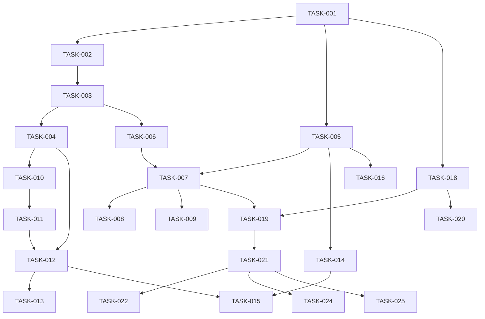

# Digital Sponsor Rebuild - Atomic Work Tasks

## Task Methodology

- Each task is **atomic** and completable in 2-4 hours
- **Dependencies** clearly defined - no task starts until dependencies complete
- **Priority** levels ensure critical path completion
- **Test-driven** - each task includes testing requirements
- **Commit-driven** - each task results in a meaningful commit

---

## Priority Levels

- **P0** - Critical path blockers
- **P1** - Core functionality
- **P2** - Important features
- **P3** - Nice to have

---

## Phase 1: Foundation & Infrastructure (Weeks 1-2)

### **TASK-001: Project Structure & Tooling Setup**

- **Priority**: P0
- **Dependencies**: None
- **Effort**: 3 hours
- **Description**: Initialize modern TypeScript monorepo with workspaces
- **Deliverables**:
  - Root package.json with workspaces
  - TypeScript configs for shared/api/web
  - ESLint + Prettier configuration
  - Husky git hooks setup
  - Basic folder structure
- **Tests**: Build and lint successfully
- **Commit**: `feat(infrastructure): initialize TypeScript monorepo with tooling`

### **TASK-002: GitHub Actions CI/CD Pipeline**

- **Priority**: P0
- **Dependencies**: TASK-001
- **Effort**: 4 hours
- **Description**: Create complete CI/CD pipeline with testing and security
- **Deliverables**:
  - `.github/workflows/ci.yml` - Build, test, lint, security scan
  - `.github/workflows/cd-staging.yml` - Deploy to staging
  - `.github/workflows/cd-production.yml` - Deploy to production
  - Dependabot configuration
  - Branch protection rules
- **Tests**: Pipeline runs successfully on push
- **Commit**: `ci: setup GitHub Actions with build, test, and deploy workflows`

### **TASK-003: Azure Infrastructure as Code (Bicep)**

- **Priority**: P0
- **Dependencies**: TASK-002
- **Effort**: 4 hours
- **Description**: Create complete Azure infrastructure with Bicep templates
- **Deliverables**:
  - `infrastructure/main.bicep` - Complete Azure resources
  - `infrastructure/modules/` - Modular components
  - Parameter files for dev/staging/prod
  - Deployment scripts
- **Tests**: Infrastructure deploys successfully to dev environment
- **Commit**: `feat(infrastructure): add Azure Bicep templates for complete infrastructure`

### **TASK-004: Azure Key Vault & Secret Management**

- **Priority**: P0
- **Dependencies**: TASK-003
- **Effort**: 3 hours
- **Description**: Implement secure secret management with Azure Key Vault
- **Deliverables**:
  - Key Vault Bicep configuration
  - SecureConfigManager TypeScript class
  - Managed Identity setup
  - OpenAI API key secure storage
- **Tests**: Secrets retrieved successfully from Key Vault
- **Commit**: `feat(security): implement Azure Key Vault with managed identity`

### **TASK-005: Shared TypeScript Types & Utilities**

- **Priority**: P0
- **Dependencies**: TASK-001
- **Effort**: 2 hours
- **Description**: Create shared types and utilities for consistent development
- **Deliverables**:
  - `packages/shared/src/types/` - All TypeScript interfaces
  - `packages/shared/src/utils/` - Common utilities
  - Validation schemas with Joi
  - Error handling classes
- **Tests**: Type checking and validation work correctly
- **Commit**: `feat(shared): add TypeScript types and common utilities`

---

## Phase 2: Authentication & Security (Week 3)

### **TASK-006: Azure AD B2C Configuration**

- **Priority**: P0
- **Dependencies**: TASK-003
- **Effort**: 4 hours
- **Description**: Configure Azure AD B2C for authentication with 2FA
- **Deliverables**:
  - Azure AD B2C tenant configuration
  - Custom user flows for registration/login
  - Multi-factor authentication setup
  - MSAL configuration
- **Tests**: User can register and login with 2FA
- **Commit**: `feat(auth): configure Azure AD B2C with 2FA support`

### **TASK-007: Authentication Microservice**

- **Priority**: P0
- **Dependencies**: TASK-006, TASK-005
- **Effort**: 4 hours
- **Description**: Build authentication microservice with JWT handling
- **Deliverables**:
  - `services/auth/` - Express microservice
  - JWT token management
  - Session handling with Redis
  - Authentication middleware
- **Tests**: Authentication endpoints work correctly
- **Commit**: `feat(auth): implement authentication microservice with JWT`

### **TASK-008: Authorization & Permission System**

- **Priority**: P1
- **Dependencies**: TASK-007
- **Effort**: 3 hours
- **Description**: Implement role-based access control and permissions
- **Deliverables**:
  - Permission middleware
  - Role definitions
  - Protected route decorators
  - AA Traditions compliance checks
- **Tests**: Authorization correctly restricts access
- **Commit**: `feat(auth): add role-based authorization system`

### **TASK-009: Security Monitoring & Audit Logging**

- **Priority**: P1
- **Dependencies**: TASK-007
- **Effort**: 3 hours
- **Description**: Implement comprehensive security logging and monitoring
- **Deliverables**:
  - Security event logging
  - Failed login attempt tracking
  - Audit trail for sensitive operations
  - Azure Monitor integration
- **Tests**: Security events properly logged and monitored
- **Commit**: `feat(security): add comprehensive audit logging and monitoring`

---

## Phase 3: Core Backend Services (Week 4)

### **TASK-010: Database Schema & Migration System**

- **Priority**: P0
- **Dependencies**: TASK-004, TASK-005
- **Effort**: 4 hours
- **Description**: Set up Cosmos DB with proper schema and migrations
- **Deliverables**:
  - Cosmos DB database and container setup
  - Migration system for schema changes
  - Literature content schema
  - User preferences schema (anonymized)
- **Tests**: Database operations work correctly
- **Commit**: `feat(database): implement Cosmos DB schema with migrations`

### **TASK-011: Literature Service with Vector Search**

- **Priority**: P0
- **Dependencies**: TASK-010
- **Effort**: 4 hours
- **Description**: Create literature service with Azure Cognitive Search
- **Deliverables**:
  - `services/literature/` - Literature microservice
  - Azure Cognitive Search integration
  - Vector embeddings for semantic search
  - Literature ingestion pipeline
- **Tests**: Literature search returns relevant results
- **Commit**: `feat(literature): implement literature service with vector search`

### **TASK-012: Chat Service with OpenAI Integration**

- **Priority**: P0
- **Dependencies**: TASK-004, TASK-011
- **Effort**: 4 hours
- **Description**: Build chat service with Azure OpenAI and RAG
- **Deliverables**:
  - `services/chat/` - Chat microservice
  - Azure OpenAI integration
  - RAG pipeline with literature grounding
  - Context management
- **Tests**: Chat service generates accurate, grounded responses
- **Commit**: `feat(chat): implement chat service with Azure OpenAI RAG`

### **TASK-013: Crisis Detection Service**

- **Priority**: P0
- **Dependencies**: TASK-012
- **Effort**: 3 hours
- **Description**: Implement crisis detection and intervention system
- **Deliverables**:
  - Crisis keyword detection
  - Sentiment analysis integration
  - Emergency resource response system
  - Crisis escalation workflow
- **Tests**: Crisis situations detected and handled appropriately
- **Commit**: `feat(crisis): implement crisis detection and intervention system`

---

## Phase 4: Advanced Backend Features (Week 5)

### **TASK-014: Step Work Service with Encryption**

- **Priority**: P1
- **Dependencies**: TASK-010, TASK-005
- **Effort**: 4 hours
- **Description**: Create comprehensive step work system with client-side encryption
- **Deliverables**:
  - `services/step-work/` - Step work microservice
  - Client-side encryption utilities
  - All 12 step templates and prompts
  - Progress tracking system
- **Tests**: Step work data encrypted and properly managed
- **Commit**: `feat(step-work): implement encrypted step work service for all 12 steps`

### **TASK-015: AI Sponsor Feedback System**

- **Priority**: P1
- **Dependencies**: TASK-014, TASK-012
- **Effort**: 3 hours
- **Description**: Build AI-powered sponsor feedback for step work
- **Deliverables**:
  - Sponsor response generation
  - Literature-grounded feedback
  - Progress tracking and suggestions
  - Evolution analysis
- **Tests**: AI provides helpful, literature-based feedback
- **Commit**: `feat(step-work): add AI sponsor feedback system with literature grounding`

### **TASK-016: Meeting Integration Service**

- **Priority**: P2
- **Dependencies**: TASK-005
- **Effort**: 3 hours
- **Description**: Integrate with AA meeting finder APIs
- **Deliverables**:
  - `services/meetings/` - Meeting finder service
  - Location-based meeting search
  - Privacy-preserving location handling
  - Meeting reminder system
- **Tests**: Meetings found and displayed correctly
- **Commit**: `feat(meetings): implement AA meeting finder with privacy protection`

### **TASK-017: API Gateway & Rate Limiting**

- **Priority**: P1
- **Dependencies**: All previous services
- **Effort**: 3 hours
- **Description**: Implement API gateway with comprehensive rate limiting
- **Deliverables**:
  - Azure API Management configuration
  - Rate limiting policies
  - Request/response transformation
  - API documentation generation
- **Tests**: API gateway properly routes and limits requests
- **Commit**: `feat(api): implement API gateway with rate limiting and documentation`

---

## Phase 5: Frontend Foundation (Week 6)

### **TASK-018: React PWA Foundation**

- **Priority**: P0
- **Dependencies**: TASK-001, TASK-002
- **Effort**: 4 hours
- **Description**: Create modern React PWA with offline capabilities
- **Deliverables**:
  - `apps/web/` - React 18 application
  - PWA configuration with service worker
  - Offline functionality framework
  - Performance optimization setup
- **Tests**: PWA works offline and passes Lighthouse audit
- **Commit**: `feat(frontend): initialize React 18 PWA with offline capabilities`

### **TASK-019: Authentication UI Components**

- **Priority**: P0
- **Dependencies**: TASK-018, TASK-007
- **Effort**: 3 hours
- **Description**: Build authentication UI with Azure AD B2C integration
- **Deliverables**:
  - Login/Register components
  - 2FA setup and verification UI
  - MSAL React integration
  - Authentication state management
- **Tests**: Users can authenticate through UI successfully
- **Commit**: `feat(frontend): implement authentication UI with Azure AD B2C`

### **TASK-020: Design System & Accessibility**

- **Priority**: P1
- **Dependencies**: TASK-018
- **Effort**: 4 hours
- **Description**: Create comprehensive design system with accessibility
- **Deliverables**:
  - Chakra UI theme configuration
  - Custom component library
  - WCAG 2.1 AA compliance
  - Dark mode support
- **Tests**: All components meet accessibility standards
- **Commit**: `feat(frontend): implement accessible design system with dark mode`

### **TASK-021: State Management & API Integration**

- **Priority**: P0
- **Dependencies**: TASK-019
- **Effort**: 3 hours
- **Description**: Set up Redux Toolkit with RTK Query for API management
- **Deliverables**:
  - Redux Toolkit configuration
  - RTK Query API slices
  - Error handling and retry logic
  - Optimistic updates
- **Tests**: State management and API calls work correctly
- **Commit**: `feat(frontend): implement Redux Toolkit with RTK Query for API management`

---

## Phase 6: Core Frontend Features (Week 7)

### **TASK-022: Chat Interface with Real-time Features**

- **Priority**: P0
- **Dependencies**: TASK-021, TASK-012
- **Effort**: 4 hours
- **Description**: Build comprehensive chat interface with real-time updates
- **Deliverables**:
  - Chat component with message history
  - Real-time message updates
  - Typing indicators and status
  - Message formatting and citations
- **Tests**: Chat interface works smoothly with backend
- **Commit**: `feat(frontend): implement real-time chat interface with citations`

### **TASK-023: Crisis Support UI**

- **Priority**: P0
- **Dependencies**: TASK-022, TASK-013
- **Effort**: 2 hours
- **Description**: Create always-accessible crisis support interface
- **Deliverables**:
  - Crisis button component
  - Crisis modal with resources
  - Emergency contact integration
  - Quick access from all pages
- **Tests**: Crisis support accessible and functional
- **Commit**: `feat(frontend): implement crisis support UI with emergency resources`

### **TASK-024: Literature Search & Reading Interface**

- **Priority**: P1
- **Dependencies**: TASK-021, TASK-011
- **Effort**: 3 hours
- **Description**: Build literature search and reading experience
- **Deliverables**:
  - Literature search component
  - Reading interface with bookmarks
  - Citation and reference system
  - Offline reading capabilities
- **Tests**: Literature search and reading work offline and online
- **Commit**: `feat(frontend): implement literature search and reading interface`

### **TASK-025: Step Work UI with Encryption**

- **Priority**: P1
- **Dependencies**: TASK-021, TASK-014
- **Effort**: 4 hours
- **Description**: Create step work interface with client-side encryption
- **Deliverables**:
  - Step work components for all 12 steps
  - Client-side encryption implementation
  - Progress tracking UI
  - Version history and comparison
- **Tests**: Step work data remains encrypted and private
- **Commit**: `feat(frontend): implement encrypted step work UI for all 12 steps`

---

## Phase 7: Advanced Features & Polish (Week 8)

### **TASK-026: Performance Optimization**

- **Priority**: P1
- **Dependencies**: All frontend tasks
- **Effort**: 3 hours
- **Description**: Optimize frontend performance and bundle size
- **Deliverables**:
  - Code splitting and lazy loading
  - Bundle size optimization
  - Image optimization
  - Performance monitoring
- **Tests**: Lighthouse score >90, bundle size <1MB
- **Commit**: `perf(frontend): optimize performance with code splitting and lazy loading`

### **TASK-027: Offline Data Synchronization**

- **Priority**: P2
- **Dependencies**: TASK-025, TASK-024
- **Effort**: 4 hours
- **Description**: Implement robust offline data sync
- **Deliverables**:
  - Offline storage with IndexedDB
  - Sync conflict resolution
  - Background sync service worker
  - Network status handling
- **Tests**: Data syncs correctly when coming back online
- **Commit**: `feat(frontend): implement offline data synchronization with conflict resolution`

### **TASK-028: Mobile App Compilation (Capacitor)**

- **Priority**: P2
- **Dependencies**: TASK-026
- **Effort**: 3 hours
- **Description**: Compile PWA into native mobile apps
- **Deliverables**:
  - Capacitor configuration
  - iOS and Android builds
  - Native plugin integrations
  - App store preparation
- **Tests**: Mobile apps build and run correctly
- **Commit**: `feat(mobile): compile PWA into native iOS and Android apps`

### **TASK-029: Monitoring & Analytics**

- **Priority**: P1
- **Dependencies**: All services
- **Effort**: 3 hours
- **Description**: Implement comprehensive monitoring and analytics
- **Deliverables**:
  - Application Insights integration
  - Custom metrics and dashboards
  - Error tracking and alerting
  - Performance monitoring
- **Tests**: Monitoring captures and reports metrics correctly
- **Commit**: `feat(monitoring): implement comprehensive observability with Azure Monitor`

---

## Phase 8: Testing & Compliance (Week 9)

### **TASK-030: Comprehensive Test Suite**

- **Priority**: P0
- **Dependencies**: All feature tasks
- **Effort**: 4 hours
- **Description**: Create complete test coverage for all components
- **Deliverables**:
  - Unit tests for all services and components
  - Integration tests for API endpoints
  - End-to-end tests for user flows
  - Performance tests
- **Tests**: 90%+ test coverage, all tests passing
- **Commit**: `test: add comprehensive test suite with 90%+ coverage`

### **TASK-031: Security Testing & Penetration Testing**

- **Priority**: P0
- **Dependencies**: TASK-030
- **Effort**: 3 hours
- **Description**: Perform security testing and vulnerability assessment
- **Deliverables**:
  - Security test suite
  - OWASP ZAP integration
  - Dependency vulnerability scanning
  - Security audit report
- **Tests**: No critical security vulnerabilities found
- **Commit**: `test(security): add security testing and vulnerability scanning`

### **TASK-032: AA Traditions Compliance Validation**

- **Priority**: P0
- **Dependencies**: All feature tasks
- **Effort**: 2 hours
- **Description**: Validate complete AA Traditions compliance
- **Deliverables**:
  - Traditions compliance checklist
  - Privacy audit report
  - Content filtering validation
  - Anonymity verification
- **Tests**: 100% AA Traditions compliance verified
- **Commit**: `feat(compliance): validate AA Traditions compliance with audit trail`

### **TASK-033: GDPR & Accessibility Compliance**

- **Priority**: P1
- **Dependencies**: TASK-030
- **Effort**: 3 hours
- **Description**: Ensure GDPR and accessibility compliance
- **Deliverables**:
  - GDPR compliance implementation
  - Accessibility audit and fixes
  - Privacy policy automation
  - Data deletion workflows
- **Tests**: GDPR and WCAG 2.1 AA compliance verified
- **Commit**: `feat(compliance): implement GDPR and WCAG 2.1 AA compliance`

---

## Phase 9: Production Deployment (Week 10)

### **TASK-034: Production Environment Setup**

- **Priority**: P0
- **Dependencies**: TASK-003, TASK-033
- **Effort**: 4 hours
- **Description**: Configure and deploy production environment
- **Deliverables**:
  - Production Azure resources
  - SSL certificates and domain setup
  - Database migration to production
  - Backup and disaster recovery
- **Tests**: Production environment accessible and secure
- **Commit**: `feat(deployment): setup production environment with disaster recovery`

### **TASK-035: Load Testing & Performance Validation**

- **Priority**: P1
- **Dependencies**: TASK-034
- **Effort**: 3 hours
- **Description**: Validate system performance under load
- **Deliverables**:
  - Load testing scripts
  - Performance benchmarks
  - Auto-scaling validation
  - Capacity planning report
- **Tests**: System handles expected load with <3s response times
- **Commit**: `test(performance): validate system performance under production load`

### **TASK-036: Go-Live & Monitoring Setup**

- **Priority**: P0
- **Dependencies**: TASK-035
- **Effort**: 2 hours
- **Description**: Execute go-live with comprehensive monitoring
- **Deliverables**:
  - Production deployment
  - Real-time monitoring dashboards
  - Alert configuration
  - Incident response procedures
- **Tests**: System operational with monitoring active
- **Commit**: `feat(deployment): go-live with comprehensive monitoring and alerting`

---

## Task Dependency Matrix

## Critical Path

The critical path for delivery (minimum viable product):

1. TASK-001 → TASK-002 → TASK-003 → TASK-004
2. TASK-010 → TASK-011 → TASK-012 → TASK-013
3. TASK-006 → TASK-007 → TASK-019 → TASK-021 → TASK-022
4. TASK-030 → TASK-031 → TASK-032 → TASK-034 → TASK-036

**Estimated completion: 8-10 weeks following this task order**
