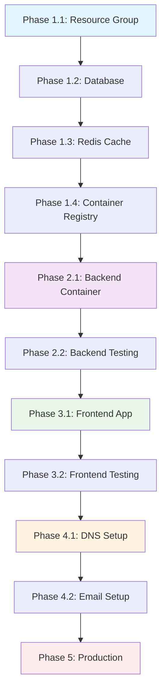

# 🚀 Digital Sponsor - Modular Deployment Guide

## 📋 **Deployment Architecture Created**

I've created a complete modular deployment system that allows you to deploy in bite-sized, manageable chunks:

### **✅ What's Been Created:**

```
deploy/
├── README.md                    # Overview and quick start
├── config/
│   └── deployment-config.sh     # Centralized configuration
├── modules/                     # Individual deployment modules  
│   └── 01-resource-group.sh     # ✅ Phase 1.1 ready
├── phase1-infrastructure.sh     # Phase orchestrator
├── rollback/                    # Rollback scripts (to be created)
└── tests/                       # Validation tests (to be created)
```

## 🎯 **Phase 1.1: Resource Group (READY TO RUN)**

The first module is complete and ready to execute. Here's what it does:

### **Module: 01-resource-group.sh**
- ✅ **Creates Azure Resource Group**: `rg-commonsolution-prod`
- ✅ **Sets up basic networking**: Container Apps managed networking
- ✅ **Configures resource policies**: Consistent tagging and naming
- ✅ **Validates setup**: Ensures permissions and accessibility
- ✅ **Saves state**: For next modules to use

### **How to Run Phase 1.1:**

```bash
# Option 1: Run just the resource group module
./deploy/modules/01-resource-group.sh

# Option 2: Run through phase orchestrator  
./deploy/phase1-infrastructure.sh --step-only 1

# Option 3: Run with interactive confirmation
./deploy/phase1-infrastructure.sh --step 1
```

## 📊 **Deployment Flow Chart**



## 🔧 **Configuration (Centralized)**

All configuration is in `deploy/config/deployment-config.sh`:

```bash
# Core Configuration
DOMAIN="commonsolution.org"
SUBDOMAIN="digitalsponsor"
RESOURCE_GROUP="rg-commonsolution-prod"
LOCATION="eastus2"

# Database Configuration  
DB_SERVER_NAME="pg-commonsolution-prod"
DB_NAME="digital_sponsor_prod"
DB_ADMIN_PASSWORD="DigitalSponsor2024!"

# Email Configuration
ADMIN_EMAIL="admin@commonsolution.org"
FORWARD_TO_EMAIL="jamessimonster@gmail.com"
```

## 🎯 **Next Steps After Phase 1.1**

Once you run the resource group module, I'll create the next modules:

### **Phase 1.2: Database Module** (Next to create)
- PostgreSQL Flexible Server setup
- Database creation and configuration
- Literature import (185 chunks)
- Connection string generation

### **Phase 1.3: Redis Module** (Next to create)
- Redis Cache creation
- Session configuration
- Connection string generation

### **Phase 1.4: Container Registry** (Next to create)
- Azure Container Registry setup
- Admin credentials configuration
- Ready for image pushes

## 🚀 **Ready to Start**

**Execute Phase 1.1 now:**

```bash
cd /home/enki/projects/digital-sponsor-investor-demo
./deploy/phase1-infrastructure.sh --step-only 1
```

This will:
1. ✅ Check Azure CLI and login status
2. ✅ Validate configuration  
3. ✅ Create resource group with proper tags
4. ✅ Set up basic networking policies
5. ✅ Validate setup and permissions
6. ✅ Save state for next modules

## 📋 **Benefits of This Modular Approach**

### **✅ Independent Deployment**
- Each module can run separately
- Failed modules don't affect others
- Easy to retry specific steps

### **✅ Safe Rollbacks**
- Rollback individual components
- Minimal blast radius for failures
- Quick recovery from issues

### **✅ Progressive Validation**
- Test each component before proceeding
- Catch issues early in deployment
- Validate connectivity at each step

### **✅ Development Workflow**
- Deploy only changed components
- Fast iteration during development
- Easy to troubleshoot specific modules

## 🔄 **What Happens After Phase 1.1**

Once you complete Phase 1.1, I'll create:

1. **Phase 1.2 Module**: Database setup with literature import
2. **Phase 1.3 Module**: Redis cache configuration  
3. **Phase 1.4 Module**: Container registry setup
4. **Phase 2 Modules**: Backend deployment and testing
5. **Phase 3 Modules**: Frontend deployment and testing
6. **Phase 4 Modules**: DNS and email configuration
7. **Phase 5 Modules**: Production monitoring and validation

Each module will be self-contained, tested, and ready to run independently.

## 🎉 **Start Your Deployment**

Run Phase 1.1 now to create your Azure foundation:

```bash
./deploy/phase1-infrastructure.sh --step-only 1
```

After this completes successfully, I'll create the next module and we'll continue building your production Digital Sponsor deployment step by step!