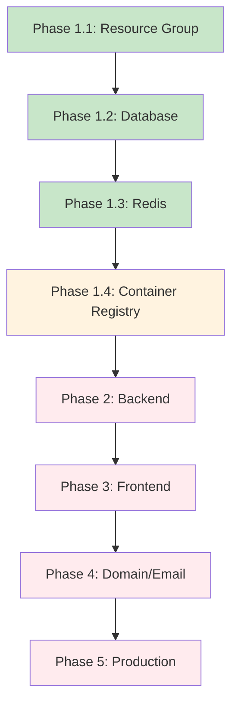

# 🚀 Digital Sponsor - Deployment Status

## 📊 **Current Progress: Phase 1 Complete**

### **✅ Completed Modules:**

#### **Phase 1.1: Resource Group Foundation** ✅
- **Module**: `01-resource-group.sh`
- **Status**: Ready to deploy
- **Creates**: 
  - Azure Resource Group: `rg-commonsolution-prod`
  - Basic networking policies
  - Resource tagging standards
  - Deployment state tracking
- **Cost**: FREE
- **Duration**: ~2 minutes

#### **Phase 1.2: PostgreSQL Database** ✅
- **Module**: `02-database.sh`
- **Status**: Ready to deploy
- **Creates**:
  - PostgreSQL Flexible Server: `pg-commonsolution-prod`
  - Database: `digital_sponsor_prod`
  - Firewall rules for Azure services
  - Literature schema and data import (185 chunks)
- **Cost**: ~$25/month
- **Duration**: ~10-15 minutes

#### **Phase 1.3: Redis Cache** ✅
- **Module**: `03-redis.sh`
- **Status**: Ready to deploy
- **Creates**:
  - Redis Cache: `redis-commonsolution-prod`
  - Session management configuration
  - Access keys and connection strings
  - Firewall rules
- **Cost**: ~$17/month
- **Duration**: ~8-12 minutes

### **⏳ Next Priority: Phase 1.4**

#### **Phase 1.4: Container Registry** (Next to create)
- **Module**: `04-container-registry.sh` 
- **Will Create**:
  - Azure Container Registry: `acrcommonsolution`
  - Admin credentials
  - Ready for Docker image pushes
- **Cost**: ~$5/month
- **Duration**: ~5 minutes

## 🎯 **How to Deploy**

### **Option 1: Deploy Phase by Phase**
```bash
# Deploy all of Phase 1 infrastructure
./deploy/phase1-infrastructure.sh
```

### **Option 2: Deploy Module by Module**
```bash
# Deploy each module individually
./deploy/modules/01-resource-group.sh
./deploy/modules/02-database.sh
./deploy/modules/03-redis.sh
./deploy/modules/04-container-registry.sh  # (to be created)
```

### **Option 3: Deploy Specific Steps**
```bash
# Deploy only specific steps
./deploy/phase1-infrastructure.sh --step-only 1    # Just resource group
./deploy/phase1-infrastructure.sh --step 2         # Start from database
```

## 💰 **Cost Breakdown**

| Component | Service | Monthly Cost | Status |
|-----------|---------|--------------|--------|
| Resource Group | Azure Resource Group | FREE | ✅ Ready |
| Database | PostgreSQL Flexible Server | ~$25 | ✅ Ready |
| Cache | Redis Basic C0 | ~$17 | ✅ Ready |
| Registry | Container Registry Basic | ~$5 | ⏳ Next |
| **Phase 1 Total** | | **~$47/month** | |

## 🏗️ **Architecture Overview**

```
commonsolution.org
├── rg-commonsolution-prod (Resource Group)
│   ├── pg-commonsolution-prod (PostgreSQL)
│   │   └── digital_sponsor_prod (Database with 185 literature chunks)
│   ├── redis-commonsolution-prod (Redis Cache)
│   │   └── Session management and caching
│   └── acrcommonsolution (Container Registry - next)
│       └── Docker images for deployment
```

## 📋 **What Each Phase Provides**

### **Phase 1: Infrastructure Foundation**
- ✅ **Secure foundation** with proper resource organization
- ✅ **Production database** with complete AA literature (185 chunks)
- ✅ **High-performance caching** for sessions and API responses
- ⏳ **Container registry** for application deployment

### **Phase 2: Backend Services** (After Phase 1)
- Backend container build and deployment
- RAG system with OpenAI integration
- API endpoints for frontend
- Health monitoring and logging

### **Phase 3: Frontend Application** (After Phase 2)
- React frontend deployment
- Static web app hosting
- PWA capabilities for mobile
- End-to-end testing

### **Phase 4: Domain & Email** (After Phase 3)
- Custom domain configuration
- SSL certificate setup
- Email forwarding setup
- DNS configuration

### **Phase 5: Production** (Final)
- Monitoring and alerting
- Performance optimization
- Backup strategies
- Security validation

## 🚀 **Ready to Deploy**

**You can start deployment now:**

```bash
cd /home/enki/projects/digital-sponsor-investor-demo

# Install Azure CLI (if needed)
# https://docs.microsoft.com/en-us/cli/azure/install-azure-cli

# Login to Azure
az login

# Start deployment
./deploy/phase1-infrastructure.sh --step-only 1
```

## 🔄 **Deployment Dependencies**



## 📊 **State Tracking**

The deployment system tracks state in `deploy/.deployment-state`:

```bash
RESOURCE_GROUP_CREATED=true
PHASE_1_1_COMPLETED=2025-10-30T14:18:04Z
DATABASE_CREATED=true
PHASE_1_2_COMPLETED=2025-10-30T14:25:12Z
DATABASE_URL=postgresql://pgadmin:...
REDIS_CREATED=true
PHASE_1_3_COMPLETED=2025-10-30T14:32:08Z
REDIS_URL=redis://redis-commonsolution-prod...
```

This allows for:
- ✅ **Safe resumption** if deployment is interrupted
- ✅ **Dependency validation** between phases
- ✅ **Rollback capabilities** for specific components
- ✅ **Connection string management** for applications

## 🎉 **What You'll Have After Phase 1**

Once Phase 1 is complete, you'll have:

- ✅ **Production-ready infrastructure** in Azure
- ✅ **Complete AA literature database** (185 chunks)
- ✅ **High-performance caching layer**
- ✅ **Container registry** for application images
- ✅ **Proper security** with firewall rules
- ✅ **Monitoring foundation** with resource tags
- ✅ **Scalable architecture** ready for application deployment

**Total setup time**: ~25-30 minutes  
**Monthly cost**: ~$47-52  
**Reliability**: Production-grade Azure services

Ready to build your Digital Sponsor platform on a solid foundation!