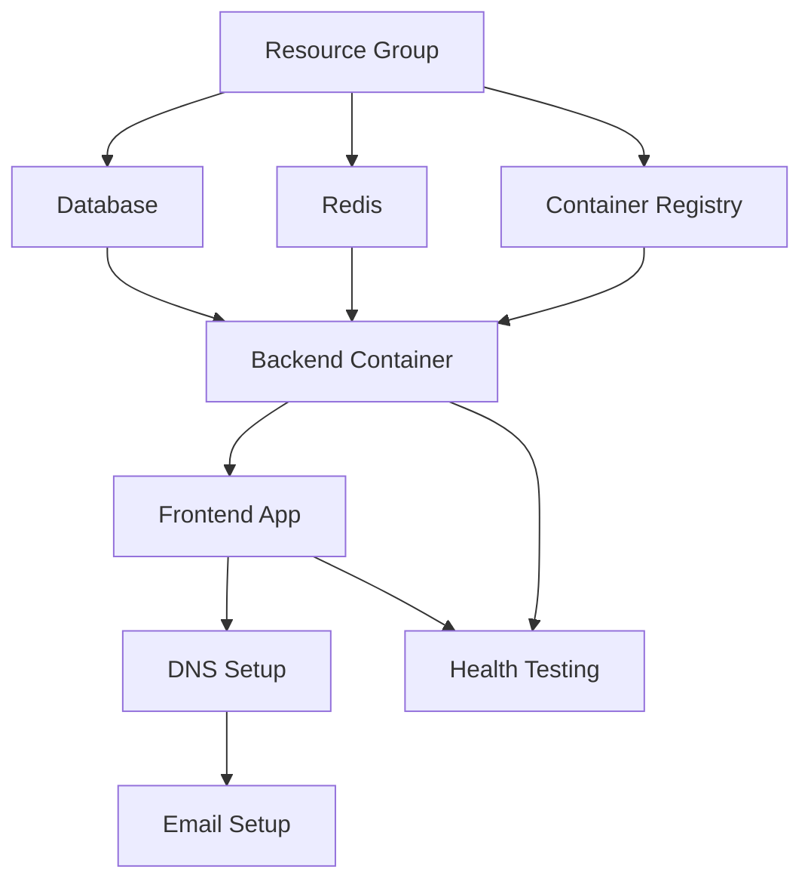

# Digital Sponsor - Modular Deployment Architecture

## 🏗️ **Deployment Philosophy**

This modular architecture allows you to:
- ✅ **Deploy incrementally** - One piece at a time
- ✅ **Test each component** - Validate before moving forward  
- ✅ **Rollback safely** - Isolate failures to specific modules
- ✅ **Rebuild selectively** - Only redeploy what changed
- ✅ **Scale independently** - Each service can scale separately

## 📋 **Deployment Phases Overview**

### **Phase 1: Infrastructure Foundation**
- **1.1**: Resource Group & Basic Infrastructure
- **1.2**: PostgreSQL Database + Literature Import
- **1.3**: Redis Cache Setup
- **1.4**: Container Registry

### **Phase 2: Backend Services**
- **2.1**: Backend Container Build & Deploy
- **2.2**: Backend Health & RAG Testing

### **Phase 3: Frontend Application**
- **3.1**: Frontend Build & Deploy
- **3.2**: End-to-End Testing

### **Phase 4: Domain & Email**
- **4.1**: DNS & Custom Domains
- **4.2**: Email Forwarding Setup

### **Phase 5: Production**
- **5.1**: Monitoring & Validation
- **5.2**: Performance Optimization

## 🔄 **Deployment Commands**

### **Full Deployment**
```bash
./deploy/deploy-all.sh
```

### **Phase-by-Phase Deployment**
```bash
./deploy/phase1-infrastructure.sh
./deploy/phase2-backend.sh
./deploy/phase3-frontend.sh
./deploy/phase4-domains.sh
./deploy/phase5-production.sh
```

### **Individual Module Deployment**
```bash
./deploy/modules/01-resource-group.sh
./deploy/modules/02-database.sh
./deploy/modules/03-redis.sh
./deploy/modules/04-container-registry.sh
./deploy/modules/05-backend.sh
./deploy/modules/06-frontend.sh
./deploy/modules/07-dns.sh
./deploy/modules/08-email.sh
```

### **Rollback Commands**
```bash
./deploy/rollback/rollback-backend.sh
./deploy/rollback/rollback-frontend.sh
./deploy/rollback/rollback-all.sh
```

## 📊 **Module Dependencies**



## 🎯 **Current Status**

- [ ] **Phase 1.1**: Resource Group ⏳ **NEXT**
- [ ] **Phase 1.2**: Database
- [ ] **Phase 1.3**: Redis
- [ ] **Phase 1.4**: Container Registry
- [ ] **Phase 2**: Backend Services
- [ ] **Phase 3**: Frontend Application
- [ ] **Phase 4**: Domain & Email
- [ ] **Phase 5**: Production

## 🚀 **Quick Start**

Run Phase 1.1 to get started:
```bash
./deploy/phase1-infrastructure.sh --step 1
```